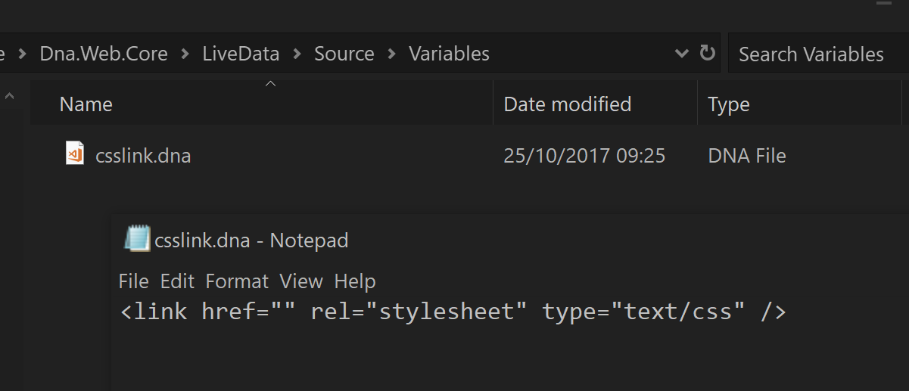
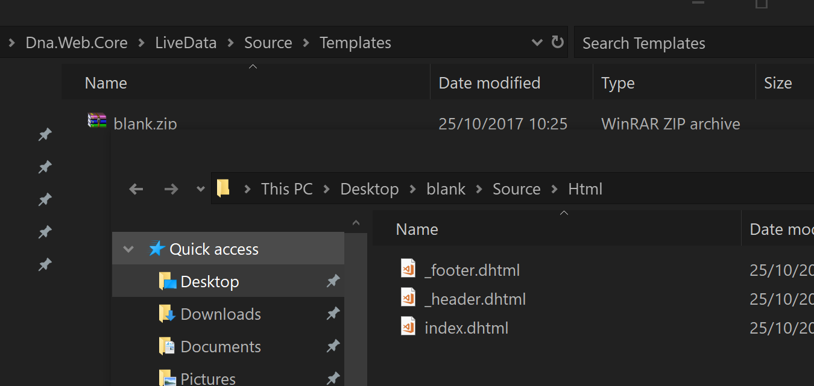

# Official DnaWeb Live Data Source

Welcome to the official DnaWeb Live Data Source. Here you can look at the source files for all of the pre-defined Live Data variables, templates and more available in DnaWeb.

Check out the **Variables** and **Templates** folder to see what is available.

# Using Live Data Sources

A **Live Data Source** for DnaWeb provides the ability to include and instantly make use of snippets and variables live while working on your web project. This can be very useful for rapid workflow.

The source folder contains a **readme.md** file explaining the Live Data source, what who made it, what's inside and general information.

## Live Variables

Anywhere inside any file of a DnaWeb engine (such as a **.dhtml** file), you can type the following:

`$$!dna.variablename$$` 

Save the file and if your editor (such as [VS Code](https://code.visualstudio.com/)) supports live updating of the file you will instantly see what you typed gets replaced with the actual contents of the Live Variable named `variablename` inside the Live Data Source with a prefix of `dna`. 

> *NOTE:* There is no need to provide the official default prefix of `dna`. If no prefix is provided then `dna` is presumed. This means `$$!dna.variablename$$` would simply become `$$!variablename`

For example the official Live Data Source has a variable named `html` that injects the most up-to-date official blank HTML document structure. Typing `$$!html$$` into a **.dhtml** file and saving it will update that file replacing the `$$!html$$` text with:

```
<!DOCTYPE html>
<html lang="en-GB">
    <head>
        <meta charset="utf-8">
        <title>$$Title$$</title>
    </head>
    <body>
    </body>
</html>
```

## Live Templates

As well as small variables/snippets it is also useful when developing a website to start from an entire template, such as a full responsive website blank template.

Live Templates allow you to extract an entire template to the current project folder with a simple command:

`new template prefix name`

Where `prefix` is the Live Source prefix you want to get the template from, and `name` is the name of the template.

> *NOTE:* Again as with variables, not specifying a prefix will presume `dna` as the prefix

For example the following being typed into the DnaWeb command interface will instantly extract the `fabric` template into the current folder:

`new template fabric`

# Adding Source to Project

To add a `Live Source` to your project simply add the relevant item to any **dna.config** file in your project. For more information check out the [main documentation](https://github.com/angelsix/docs.dnaweb/blob/master/index.md).

### Example dna.config adding a web Live Data Source

```
{
    "liveDataSources": [
    {
      "prefix": "dna",
      "source": "https://raw.githubusercontent.com/angelsix/docs.dnaweb/master/LiveData/DnaWeb/dna.live.config"
    },
}
```

| Name   | Description                              |
| ------ | ---------------------------------------- |
| prefix | If specified, overrides the default prefix this source provides |
| source | The source path to the Live Data Source **dna.live.config** file that contains information about the source |

> *NOTE:* The official DnaWeb source is already included by default in the installation folders **dna.config** file so there is no need to add it again.

# Make your own DnaWeb Live Data Source

Making and providing your own Live Data Source is easy. Create a folder and include a **readme.md** and **dna.live.config** file, along with your content in the **Variables** and **Templates** folders then include it in your projects **dna.config** file.

## Example Folder Structure

```
source folder
|-- readme.md
|-- dna.live.config
|   
`-- Variables
|   |-- var1.dna
|   |-- var2.dna
|   `-- SubFolder
|       |-- var3.dna
|
`-- Templates
    |-- template1.zip
    |-- template2.zip
    `-- SubFolder
        |-- template3.zip
```


## Live Configuration File

The source folder should contain the **readme.md** with human-readable information, as well as a file in the root folder called **dna.live.config** that provides the following information for `DnaWeb` to read.

```
{
  "version": "1.0.0",
  "author": "Luke Malpass",
  "name": "DnaWeb",
  "description": "The official DnaWeb Live Data Source",
  "prefix": "dna",
  "source": "https://raw.githubusercontent.com/angelsix/docs.dnaweb/master/LiveData/DnaWeb/Source.zip"
}
```

| Name        | Description                              |
| ----------- | ---------------------------------------- |
| version     | Specifies the version to the user if queried with `source versions` command |
| author      | Who made the Live Data Source            |
| name        | The short name for this source, output with the `source info` command |
| description | A more detailed description of the source if requested with `source info [name]` |
| prefix      | The prefix to use with the Live Variable `$$!prefix.name$$` syntax. For example `$$!dna.html$$` |
| source      | The absolute path/url to the Live Data Source zip file containing this source folder |

## Live Variables

All Live Variables in your source should be inside a root folder called **Variables**.

Any number of sub-folders within reason can be created. The folder will be searched and files found from it.

To create a Live Variable simply create a file anywhere inside the **Variables** folder or a child folder, with the extension of **.dna** 

An example Live Variable for replacing `$$!csslink$$` which is in the official Live Data Source is below:

**csslink.dna**

```
<link href="" rel="stylesheet" type="text/css" />
```



## Live Templates

Live Templates are basically **.zip** files that contain all the contents you would like to extract to the project folder. They are as simple and as complicated as you like. 

Place a **.zip** file with the name of the template you want to use, and the contents inside. For example in the official source we have a template called **blank.zip** that can be used via `new template blank` to extract the **blank.zip** file into the project folder, producing a starting point for a web project, containing a source folder, basic Sass file and DnaWeb Html files for a basic header/footer/index setup ready to start your next web project with one line.



