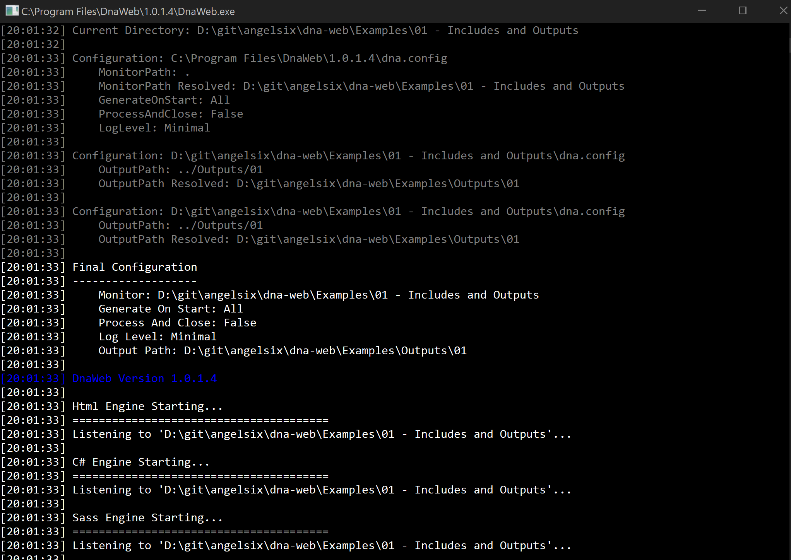

<div style="text-align: center">

<h1 id="download">Download</h1>

<a href="Releases/DnaWeb-1.0.5.0-Release-x86.msi">DnaWeb 1.0.5.0 (32bit)</a><br>
<a href="Releases/DnaWeb-1.0.5.0-Release-x64.msi">DnaWeb 1.0.5.0 (64bit)</a><br>

<br><a href="previous">Previous Versions</a><br>

<a href="https://github.com/angelsix/dna-web" class="button" target="_blank">View On GitHub</a>
<a href="#installing-dnaweb" class="button">Install Guide</a>

</div>

# DNA Web Engine

When first building your website you don’t typically work directly in ASP.Net, or PHP or other final server languages. You build your website in plain static HTML/CSS, then once done you convert them to headers, footers, cshtml files etc...

> **Note:** All brand icons are trademarks of their respective owners. The use of these trademarks does not indicate endorsement of the trademark holder by me, nor vice versa. 

## The issue with static HTML

The issue with doing plain HTML is that is not your final format. Plain HTML cannot have shared headers and footers that are the same throughout pages. It cannot have variables, multiple outputs, multiple formats or anything else.

Changing the header of one page, you need to change the header of all other pages, manually, one at a time. The same for any other shared values such as page links that could be anywhere in the pages.   Once you start converting your website to your final server code (cshtml for example) the issues really start. Now you have 2 separate codes to maintain (static HTML and cshtml).

## Enter, DNA Web Engine

Using the DNA Web Engine allows you to write completely standard HTML code, and just insert HTML comments to do extra useful things. For example, let’s create a shared header and footer as normal HTML, simply with an extension of dhtml instead of .html

**header.dhtml**

```
<html>
  <head>
    <title>My title</title>
  </head>
  <body>
```

**footer.dhtml**

```
  </body>
</html>
```

Now we can create all our pages in regular HTML format, but with comments to insert the header and footer.

```
<!--@ include header @-->
  <h1>Header</h1>
<!--@ include footer @-->
```

**Outputs**
By default if your file is called *index.dhtml* then the output file will be in the same directory called *index.html.* ([unless a Html Output Path is specified in a configuration file](#configuring-dnaweb))

To modify the output filename and path (relative to the input file), in your dnaweb file specify the new name in the output tag. You can specify more than one output to generate multiple files with different names in different locations.

```
<!--@ output home @-->
<!--@ output extra @-->
<!--@ include header @-->
  <h1>Header</h1>
<!--@ include footer @-->
```

## Partials

Some files like headers and footers should not generate files themselves, they are simply partial files to be included.

To prevent DNA from generating output for a file, you can either start the filename with an underscore such as **_header.dhtml** or add the partial tag to it, like so:

**header.dhtml**

```
<!--@ partial @-->
<html>
  <head>
    <title>My title</title>
  </head>
  <body>
```

## Variables

Another useful feature is the ability to create variables that can be inserted anywhere in the HTML. A good example is using them for page titles and URLs.

```
<!--$ 
  <Data>
    <Variable Name="Title">My title</Variable>
    <Variable Name="HomeUrl">https://github.com/angelsix/dna-html-engine</Variable>
  </Data>
$-->
<html>
  <head>
    <title>$$Title$$</title>
  </head>
  <body>
    <p>Get the source code <a href="$$HomeUrl$$" />here</a>.
  </body>
</html>
```

To create variables, first start a special *code* block comment using `<!--$`and ending with `$-->`. Inside that place the `<Data></Data>` tag just like a HTML tag. 

Inside the data element you can now create variables with names and values just like any XML/HTML element.

To then use them inside your HTML, use the given name you created, wrapped inside`$$...$$`, for example `$$Title$$`

## Dna Variables

As well as defining variables yourself, DnaWeb has a bunch of in-built useful variables, you use in just the same way with the prefix `dna.`

| Dna Variable                    | Output                    | Description                              |
| ------------------------------- | ------------------------- | ---------------------------------------- |
| `$$dna.Date("MMMM dd, yyyy")$$` | October 10, 2017          | The current date/time in the specified string format |
| `$$dna.ProjectPath$$`           | D:\Some\Folder            | The current directory where the main project is (where DnaWeb has been run from) |
| `$$dna.FilePath$$`              | D:\Some\Folder\file.dhtml | The full path of the current file this variable resides within |

If you have any requests for more variables, simply ask for them in the <a href="https://github.com/angelsix/dna-web" target="_blank">GitHub Repo</a>

## Output Profiles

Sometimes you need multiple outputs of a single file. For example the static HTML output and the server cshtml file. Profiles allow you to specify a name for a profile, then customize variables, output filenames and more.

Here is an example of generating three files from the same file, each with their own header text:

```
<!--@ output index-release @-->
<!--@ output index-uat:uat @-->
<!--@ output index-debug:debug @-->
<!--$ 
  <Data>
    <Variable Name="Title">My title</Variable>
    <Variable Name="Title" Profile="debug">My debug title</Variable>
    <Profile Name="uat"> 
      <Variable Name="Title">My user title</Variable>
    </Profile>
  </Data>
$-->
<html>
  <head>
    <title>My title</title>
  </head>
  <body>
    <h1>$$Title$$</h1>
  </body>
</html>
```

As you can see, you define variables as you normally would, except you can provide a "Profile" attribute to the variable which means that variable only applies to outputs that define a profile name that matches.

You can also create a "Profile" element and then any variables inside of that element automatically get that profile name.

Finally, to generate an output file that uses a specific profile and so specific variables end the filename with a colon : and then the profile name.

## Input Profiles

As with output profiles, you can use the same profile technique to only include files for specific profiles. The perfect use-case for this is ASP Net cshtml files that use a layout file. As such all cshtml files of specific pages don’t include a header and footer, they simply specify the layout to use or the default one is chosen.

Here is an example that generates a full static HTML page called index.html and an ASP.Net index.cshtml page that doesn’t include the header or footer.

```
<!--@ output index:wrapped @-->
<!--@ output index.cshtml @--> 
<!--@ include header:wrapped @-->
  <h1>Header</h1>
<!--@ include footer:wrapped @-->`
```

As you can see by specifying a profile named "wrapped" then setting the index.html output to use that profile, and the includes for the header and footer to only include the files for the profile "wrapped" we end up with just the header <h1> in the .cshtml file but the complete file for the .html file.

## Inline Data

Sometimes you want to include some small and simple HTML into your file inline, and not create a separate include file just for a few lines of HTML or javascript.

You can inline data that will get inserted for all outputs, for outputs that do not specify a profile, and for specific profiles.

```
<!--@ output server:server @-->
<!--@ output local @-->
  <h1>Header</h1>
<!--@ inline <h1>This is in all outputs</h1> @-->
<!--@ inline:! <h1>This is in default outputs only</h1> @-->
<!--@ inline:server <h1>This is in server output only</h1> @-->
```

The above will generate a local.html file (that does not specify any profile) which will contain:

```
<h1>Header</h1>
<h1>This is in all outputs</h1>
<h1>This is in default outputs only</h1>
```

And a server.html file (that specifies the profile *server*) which will contain:

```
<h1>Header</h1>
<h1>This is in all outputs</h1>
<h1>This is in server output only</h1>
```

As you can see, just like outputs and inputs, you can add a colon : then a profile name to the end of the *inline* name statement.

>   NOTE: The bang (!) instead of a profile name means to only include if there is explicitly no profile selected. Without the ! the inline would be included for outputs that specify a profile as well as those that do not.

## C# and Beyond

The engine is not limited to HTML files, it was simply created initially to aid in the general static web development, however it’s really a universal engine.

When working with ASP.Net files you typically end up creating links between the HTML and the back-end C# code. As such, it would be great to be able to share variables between the two. With the help of the DNA Web Engine you can.

Say you have a menu element you want to access from the C# ASP.Net side through the DOM and you need the element ID. Typically you would have the ID value stored in ASP.Net in a code file, and you would have the ID typed into the html/cshtml file as well. You would have to keep both names the same and if you edit one you need to remember to edit the other.

Instead, using the C# engine you can specify the ID as a variable and use it to generate both the cshtml file and a C# code file.

Place your variable in a partial file:

**variables.dhtml**

```
<!--@ partial @-->
<!--$ 
<Data>
  <!-- The shared values for the application -->
  <Group Name="SharedVariables" Profile="">
    <!-- Comment for some ID -->
    <Variable Name="SomeId1" Type="string">SomeId</Variable>
    
    <!-- 
    This is a multiline comment 
    that maintains spacing
    and indentation level
    -->
    <Variable Name="SomeId2" Type="string">AnotherID</Variable>

    <!-- Another comment -->
    <Variable Name="MyString" Type="string">This can be a multiline 
    string</Variable>
  </Group>
</Data>
$-->
```

Notice the use of a new element called a *Group*. A group simply groups a bunch of variables and will be used to automatically add *#region* areas to the code file. You can still give the variables profile names and anything else you do with a variable.

Now let’s use those variables in a dnaweb file to create a cshtml file as normal:

**index.dhtml**

```
<!--@ include variables @-->
<h1>My Id 1 is: $$SomeId1$$</h1>
<h1>My Id 2 is: $$SomeId2$$</h1> 
<h1>My string is: $$MyString$$</h1>
```

Then let’s generate a C# file that can be included in our ASP.Net project to give us access to the exact same variables are are used in the cshtml file:

**codefile.cs**

```
<!--@ output variables @--> 
namespace SomeNamespace 
{
  /// <summary> 
  /// A generated class from DnaWeb 
  /// </summary> 
  public class MyVariablesClass 
  { 
    <!--# properties group=SharedVariables #--> 
  }
}
```

That will generate a new C# class file and replace the `<!--# properties #-->` value with the variables inside the group *SharedVariables*.

The variables will be generated as public properties of the correct type (string, boolean, int etc..).

The comments for the properties will come from the comments specified in the variables file.

The variables will also be wrapped in a *#region* with the same name as the group.

## Sass

DnaWeb now has the ability to process Sass files (.scss) and generate .css files from them.

Simply run DnaWeb in the directory of your choice and any .scss files will automatically produce css files as they are changed.

## Live Server

Another common tool used in the static web development lifecycle is a way to serve the static html files in a web server so you can do http://localhost:5000/about for example to serve an about page, typically called **about.html**

Now with DNA Live Servers you can.

Also the ability to watch live in a browser for file changes and refresh the page automatically is very beneficial. This feature is also included in Live Server.

To have DnaWeb spin up a server for you automatically on a free port on your local machine, and start serving the html and other content files in a specific folder, just specify an array of paths in any **dna.config** file. The paths are relative to the **dna.config** file location.

For example, the **Examples** folder in this repository has a folder called **09 - LiveServer** and inside it the DnaWeb source files are there. The **dna.config** file specfies that the output (html) files go to `../Outputs/09` folder, and so we also set up a Live Server to that folder too.

```
{
    "outputPath": "../Outputs/09",
    "liveServers": [ "../Outputs/09" ]
}
```

Now just start DnaWeb in your source folder and a Live Server will be created and your browser automatically opened to the new server address, along with the **index.html** file in the **Outputs/09** folder being served by default.


If you then typed in http://localhost:51767/about for example it would attempt to find and load a html file in **Outputs/09** called **about.htm** (or .html). 

Any other requests such as http://localhost:51767/Assets/Css/style.css will then look for **Outputs/09/Assets/Css/style.css** and serve that.

Mime types will be honoured, and the server will server the files length, date, modified date and so on.

Go ahead and edit a .dhtml file, a .scss file or even a file directly in the output folder if you like, and watch the website automatically refresh.

## Live Data Sources

A **Live Data Source** for DnaWeb provides the ability to include and instantly make use of snippets and variables live while working on your web project. This can be very useful for rapid workflow.

The source folder contains a **readme.md** file explaining the Live Data source, what who made it, what's inside and general information.

### Live Variables

Anywhere inside any file of a DnaWeb engine (such as a **.dhtml** file), you can type the following:

`$$!dna.variablename$$` 

Save the file and if your editor (such as <a href="https://code.visualstudio.com" target="_blank">VS Code</a>) supports live updating of the file you will instantly see what you typed gets replaced with the actual contents of the Live Variable named `variablename` inside the Live Data Source with a prefix of `dna`. 

> *NOTE:* There is no need to provide the official default prefix of `dna`. If no prefix is provided then `dna` is presumed. This means `$$!dna.variablename$$` would simply become `$$!variablename$$`

For example the official Live Data Source has a variable named `html` that injects the most up-to-date official blank HTML document structure. Typing `$$!html$$` into a **.dhtml** file and saving it will update that file replacing the `$$!html$$` text with:

```
<!DOCTYPE html>
<html lang="en-GB">
    <head>
        <meta charset="utf-8">
        <title>Title</title>
    </head>
    <body>
    </body>
</html>
```

### Live Templates

As well as small variables/snippets it is also useful when developing a website to start from an entire template, such as a full responsive website blank template.

Live Templates allow you to extract an entire template to the current project folder with a simple command:

`new template name`

Where `name` is the Live Template's `prefix.name`, for example `dna.blank` for the Blank template from the DnaWeb official Live Data Source.

> *NOTE:* Again as with variables, not specifying a prefix will presume `dna` as the prefix

For example the following being typed into the DnaWeb command interface will instantly extract the `fabric` template into the current folder:

`new template fabric`

### Making your own Live Data Source

To make your own take a look at our example <a href="https://github.com/angelsix/dna-web/tree/master/Source/Dna.Web.Core/LiveData/Source" target="_blank">on GitHub</a>

## Installing DnaWeb

If you want to create your own Windows installer, download and install [Wix](http://wixtoolset.org/) and then right click on the **Dna.Web.Installer** project in Visual Studio to compile an msi file. The output of the compile will be in a folder inside **Dna.Web.Installer** called **Installs**

Alternatively download a pre-made version from [here](#download)

Once installed on your system, DnaWeb will be a self-contained .Net Core application in your Program Files folder under DnaWeb. 

This installed path will also be added to your systems **PATH** variable. This means you can run DnaWeb from anywhere in command line.

## Running DnaWeb on a Project/Folder

Let's say you have a folder now containing your website, its assets, images, css, html, dnaweb files and so on. At the start of your work day, you would just navigate to that folder in Explorer, then in the address bar type `dnaweb` to open and run a DnaWeb engine in that folder.




This simply finds the self-contained **DnaWeb.exe** file located in the **Program Files** installation folder, then runs DnaWeb.

DnaWeb will first load the default configuration file from the install folder, and then look in the executing folder (where you ran dnaweb from command line) for a configuration file also, and load in your custom project settings. Finally it will check any command line arguments and load those. That is also the order of precedence so the arguments override the project folders configuration which overrides the default configuration. 

Now just edit/create your files and DnaWeb will process them automatically. Once done press enter twice to exit DnaWeb.

## Run DnaWeb on Prebuild Visual Studio

If you would like continuous integration, or run a build server, or simply want to make sure every time you build your Visual Studio project that any DNA web files are processed, you can run the engine as a pre-build command to Visual Studio to run every time you build your project.

Change your projects pre-build command to call a .bat or .cmd batch file. Then in that batch file write:

### Direct Invoke from compiled source

`dotnet Dna.Web.CommandLine.dll . /a /c monitor=../DnaWeb`

### Invoking from an installed instance

`dnaweb /a /c monitor=../DnaWeb`

## Compiling DNA Web Engine

Open up the Source folder, then the **Dna.Web.sln** solution file. With Visual Studio open make sure **Dna.Web.CommandLine** is set as the startup project. If not right click **Dna.Web.CommandLine** and select **Set as Startup Project**.

Now press F5 to run the engine. This will run the engine, opening a command line window that should output where it is listening for file changes and state **Press enter to stop**.

By default the engine looks in the folder it is run in, so from Visual Studio that is the **Dna.Web.CommandLine** folder. 

## Configuring DnaWeb

Settings such as the monitor path, whether to generate all files on start, and whether to close right after can be set in a **dna.config** file in the same directory where you run DnaWeb from.

An example dna.config file is below:

```
{
  "monitor": ".",
  "generateOnStart": "All",
  "processAndClose": "False",
  "logLevel": "Minimal",
  "outputPath": "../WebRoot",
  "scssOutputStyle": "Compressed",
  "scssGenerateSourceMap": "False",
  "openVsCode": "True",
  "liveServers": [ "../WebRoot" ],
  "liveDataSources": [
  {
    "prefix": "dna",
    "source": "https://raw.githubusercontent.com/angelsix/dna-web/develop/Source/Dna.Web.Core/LiveData/dna.live.config"
  }
  ],
  "cachePath": "%LOCALAPPDATA%\\DnaWeb\\%VERSION%\\Cache\\"
}
```

| Property              | Description                              |
| --------------------- | ---------------------------------------- |
| monitor               | A relative or absolute path to monitor, based on the folder where DnaWeb was called from |
| generateOnStart       | `None, All`. Specifies whether to generate all DnaWeb file types on startup without the need for them to be changed first |
| processAndClose       | `False, True`. Whether DnaWeb closes right after opening and optionally generating all files. Typically used in combination with **generateOnStart** being set to `All` |
| logLevel              | `None, Minimal, Informative, All` The amount of detail to output in the log |
| outputPath            | Sets the output path for all files, relative to this configuration files location |
| scssOutputStyle       | `Nested, Expanded, Compact, Compressed, Inspect` Sets the css output style |
| scssGenerateSourceMap | `False, True` If a ***.css.map** file should be created for the css files |
| openVsCode            | `False, True` If true and VS Code is installed, it will be opened on startup with the current monitor folder as the source |
| liveServers           | An array of strings that specify paths (relative to the configuration file) that should have a Live Server spun up for them |
| liveDataSources       | An array of Live Data Sources            |
| cachePath             | The relative or absolute path where any DnaWeb cache data goes (the default is the Local App Data folder of the machine) |

These values can also be overridden when calling DnaWeb from command line by passing in command line arguments:

| Argument               | Description                              |
| ---------------------- | ---------------------------------------- |
| monitor=               | Overrides any monitor path specified in dna.config files |
| logLevel=              | Overrides the log level                  |
| outputPath=            | Overrides the Output Path                |
| scssOutputStyle=       | Overrides the Scss Output Style          |
| scssGenerateSourceMap= | Overrides the Scss Generate Source Map   |
| openVsCode=            | Overrides the Open VS Code               |
| /a                     | Overrides any generate on start options specified in dna.config files and sets it to `All` |
| /c                     | Overrides any process and close options specified in dna.config files and sets it to `True` |
| cachePath              | Overrides any cache path setting specified in dna.config files |

> You can also place a **dna.config** file in any sub-folder inside the monitor path to apply settings to that specific folder and it's children. Configuration files in child folders override any settings specified in a parent folders configuration file.

The Visual Studio project has a debug argument set to monitor=../../Examples so that when debugging it monitors the Examples folder of the solution.

Now with the engine running, edit any file in the Examples folder and the console will detect the change and automatically process the files and generate the outputs. All details are output to the console window.

The typical work-cycle when using DNA Web Engine is to start the engine up prior to working, then work with your DnaWeb files as required, meaning any edits to those files will auto-generate your HTML/C#/Sass files instantly..!